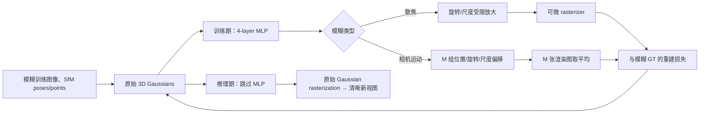

> **题名核对**：用户给出的“PCGS: Deblurring 3D Gaussian Splatting with Patch Comparison”不是本文原文标题，也未见作者将方法称作 PCGS 或 Patch Comparison。本文笔记依据已核实的 [arXiv:2401.00834](https://arxiv.org/abs/2401.00834) 完整正文与 supplementary；正式发表为 ECCV 2024，页 127–143，DOI 为 [10.1007/978-3-031-73636-0_8](https://doi.org/10.1007/978-3-031-73636-0_8)。

## 一句话总结

Deblurring 3D Gaussian Splatting 把“模糊”放入训练期的 Gaussian 几何：MLP 为每个原始 Gaussian 生成受限的尺度/旋转（以及运动模糊时的位置）扰动以拟合模糊观测；清晰模型则是同一组未扰动 Gaussian，故推理既不需要 kernel MLP，也不丢失 3DGS 的实时 rasterization。

## 背景与问题

标准 3DGS 假定训练图像清晰。若直接在散焦或快门期间相机抖动的图像上优化，Gaussian 会将跨像素混合的观测纹理写入场景，得到的 novel views 同样发糊。Deblur-NeRF、DP-NeRF、PDRF 能将模糊建模为 ray/kernel 的积分，但它们依赖 volumetric rendering，不能直接移植到 tile-based Gaussian rasterizer，也无法保持高帧率。

作者的关键假设是：

- **散焦模糊**可由更大、视图相关的 Gaussian 协方差表达；更大的 splat 覆盖更多邻域，等价于让相邻像素信息混合。
- **相机运动模糊**可由曝光期间多个离散时刻的 Gaussian 几何集合表达；分别渲染后平均就是时间积分的离散近似。

研究问题因而是：能否只在训练时让 Gaussian 变形以解释模糊图像，而把未变形的 Gaussian 保留为实时清晰渲染器？

## 方法详解

### 整体框架

设第 \(j\) 个 Gaussian 的均值、旋转四元数和尺度为 \((x_j,r_j,s_j)\)。其协方差采用 3DGS 的正半定参数化：

\[
\Sigma(r,s)=R(r)S(s)S(s)^\top R(r)^\top.
\]

这避免直接学习协方差时破坏正半定性；屏幕空间协方差再由投影 Jacobian 与 world-to-camera 变换得到。按深度 alpha compositing 后即为 3DGS 图像。

### 1. 散焦：只允许训练期协方差变“宽”

MLP 输入 positional encoding 后的位置 \(\gamma(x_j)\)、\(r_j,s_j\) 与视线方向 \(\gamma(v)\)，输出 \((\delta r_j,\delta s_j)\)。作者将输出缩放并截断，使变换倍数不小于 1：

\[
\hat r_j=r_j\cdot\min(1,\lambda_s\delta r_j+1-\lambda_s),\quad
\hat s_j=s_j\cdot\min(1,\lambda_s\delta s_j+1-\lambda_s).
\]

这里的写法等价于将网络输出限制在“只扩张、不收缩”的方向（原文文字亦明确 \(\hat s_j\ge s_j\)）。扩张 Gaussian 负责解释散焦中更大范围的邻域混合；焦内或细节区域的倍率接近 1。训练用 \(G(x_j,\hat r_j,\hat s_j)\) 拟合模糊图，测试改回 \(G(x_j,r_j,s_j)\)，于是细小 Gaussian 显示出被训练期模糊掩盖的细节。

### 2. 相机运动：多组辅助 Gaussian 近似曝光积分

对每个原始 Gaussian，MLP 输出 \(M\) 组 \((\delta x_j^{(i)},\delta r_j^{(i)},\delta s_j^{(i)})\)。第 \(i\) 组生成一个略有平移、旋转/尺度变化的场景，分别 rasterize 为 \(I_i\)，训练图像为：

\[
I_{\mathrm{blur}}\approx\frac{1}{M}\sum_{i=1}^{M} I_i.
\]

这并非恢复真实相机轨迹；它是用 per-Gaussian 的自由形变去吸收轨迹与几何误差的**隐式近似**。实验取 \(M=5\)。推理期仍只保留原始集合，避免五次渲染。

### 3. 训练工程

原文采用 4 层、宽度 64、ReLU 的 MLP；前三层共享，\(\delta x,\delta r,\delta s\) 各有一层 head，Xavier 初始化。\(\lambda_p=\lambda_s=10^{-2}\)，共训练 20k iterations；为缓解稀疏 SfM 初始化，2,500 iteration 后补点（最多 200k），并沿深度 pruning。除阈值外，其余优化设置遵循 3DGS。重要的是：这些 MLP 与辅助集合都是训练 scaffold，不属于部署模型。

## 实验证据

数据为 Deblur-NeRF benchmark 的真实散焦与真实相机运动模糊子集；PSNR、SSIM 越高越好，LPIPS 越低越好。比较对象包含原始 3DGS、先 Restormer 去模糊再训 3DGS，以及 Deblur-NeRF / Sharp-NeRF / DP-NeRF / PDRF-10。

| 真实数据平均值 | 方法 | PSNR ↑ | SSIM ↑ | LPIPS ↓ | FPS ↑ |
| --- | --- | ---: | ---: | ---: | ---: |
| 散焦（10 scenes） | 3DGS | 20.57 | 0.6064 | 0.2920 | 788 |
| 散焦（10 scenes） | PDRF-10 | **23.85** | 0.7382 | 0.1746 | <1 |
| 散焦（10 scenes） | **本文** | 23.71 | **0.7471** | **0.1068** | **804** |
| 相机运动（10 scenes） | 3DGS | 21.66 | 0.6154 | 0.3240 | 734 |
| 相机运动（10 scenes） | DP-NeRF | 25.91 | 0.7751 | 0.1602 | <1 |
| 相机运动（10 scenes） | **本文** | **26.61** | **0.8224** | **0.1096** | **961** |

关键解读：

- 散焦上，本文 PSNR 比 PDRF-10 低 0.14 dB，却将 LPIPS 从 0.1746 降至 0.1068，并以 804 FPS 保持实时；所以“全面最佳”应限定为感知质量、SSIM 与速度，而不是 PSNR。
- 相机运动上，本文相对 DP-NeRF 提升 0.70 dB PSNR、0.0473 SSIM，并将 LPIPS 降低约 31.6%；同时从亚 1 FPS 到 961 FPS，是本文最强证据。
- 只做 Restormer 预处理再训练 3DGS 在两类真实数据上明显弱于联合建模，说明逐帧 2D 去模糊没有解决多视角几何一致性。

## 亮点与局限

**论文亮点**：用 Gaussian 的可解释几何量承载训练模糊，设计与 rasterization 原生兼容；训练/推理分离干净，测试时没有 MLP、kernel 或多样本开销；真实相机运动模糊上的质量—速度组合很有说服力。

**作者明确的限制**：现有 NeRF 去模糊 kernel 不易直接接入 rasterizer；若改在 2D raster image 空间插值 kernel，会增加像素插值成本，并且只隐式改变 Gaussian 几何。

**独立分析**：

- “散焦等于协方差变大”的先验适用于点扩散，但对强遮挡边界、非圆形 aperture、空间不连续 PSF 的表达力有限；网络的 per-Gaussian 变形也可能把真实几何误差当作模糊吸收。
- 运动部分以每个 Gaussian 的独立偏移近似相机运动，缺少所有点共享同一 SE(3) exposure trajectory 的物理约束，因此其“相机运动”解释不可直接用于相机轨迹恢复。
- 补点、深度 pruning、不同数据集阈值均会影响结果；正文把更多消融放在 supplementary，未报告多随机种子方差，复现时应优先检查这些工程项。
- 推理虽与 3DGS 相同，但训练需要 MLP、五组运动辅助渲染及额外点管理；不能把 804/961 FPS 误读成训练成本也几乎不变。

## 与相关工作的对比

| 方法 | 模糊模型 | 训练/推理成本 | 主要取舍 |
| --- | --- | --- | --- |
| Deblur-NeRF | 由 MLP 预测 ray/kernel，体渲染积分 | 推理仍依赖体渲染，<1 FPS | 表达灵活但慢 |
| DP-NeRF / PDRF | 物理先验或两阶段 radiance field | 仍是体渲染，<1 FPS | 质量强、实时性弱 |
| Restormer + 3DGS | 先独立 2D 去模糊 | 3DGS 实时 | 多视图一致性不足 |
| **本文** | 训练期 Gaussian 协方差/位置形变 | 推理回到原始 3DGS | 实时，但依赖几何形变先验 |

## 评分

| 维度 | /10 | 依据 |
| --- | ---: | --- |
| 创新性 | 8.0 | 将模糊转写为训练期 Gaussian 几何形变，并在推理移除辅助网络。 |
| 技术可靠性 | 7.6 | 两种模糊都有明确的渲染构造，但运动轨迹是隐式近似。 |
| 实验充分度 | 7.5 | 有真实/合成数据、三指标和 supplementary；缺多 seed 统计。 |
| 写作清晰度 | 8.0 | 训练/推理分离、协方差参数化清楚。 |
| 实用/研究价值 | 8.7 | 在真实运动模糊中兼具 SOTA 质量与约千 FPS，部署优势直接。 |

**总体推荐：值得细读。** 最应记住的是“让训练模型负责解释退化，让部署模型回到干净的原始表示”；最应验证的是几何形变与真实 blur kernel/相机轨迹之间的对应关系。

## 相关论文

- [3D Gaussian Splatting for Real-Time Radiance Field Rendering](https://arxiv.org/abs/2308.04079) — 基础表示与 rasterizer。
- [Deblur-NeRF](https://arxiv.org/abs/2111.14292) — 本文主要对照：以 kernel/ray 建模模糊的体渲染方案。
- [DP-NeRF](https://arxiv.org/abs/2211.12046) — 加入物理先验的 NeRF 去模糊基线。
- [PDRF](https://ojs.aaai.org/index.php/AAAI/article/view/25295) — 逐步去模糊 radiance field 基线。
